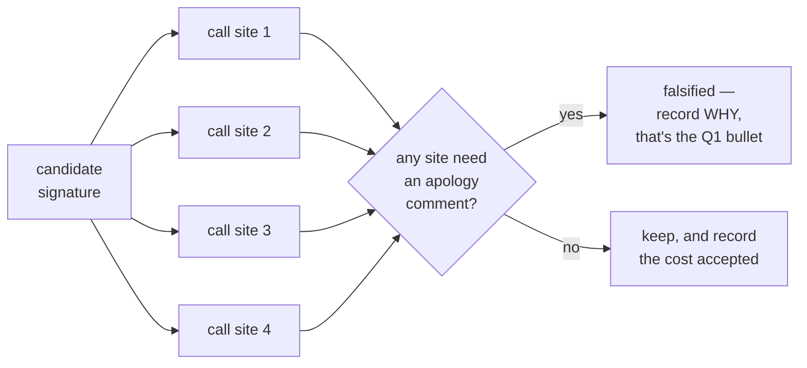
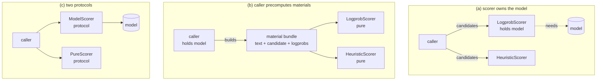

# What a finished interface answer looks like — a worked example

> Provenance: Claude-written teaching scaffolding. **Every design decision in
> this file is about a dependency resolver's version picker, not about this
> repo's scorer.** It exists to calibrate the *shape* of an answer. The
> reasoning is deliberately domain-specific so that nothing here transfers
> verbatim — if you find yourself copying a conclusion, you have copied the
> wrong layer. Companion to `docs/scorer-interface-worksheet.md`.

## Why an analogue

A dependency resolver picking one version of a package has the same four
problems as the scorer, in a domain with no overlap:

| Scorer problem | Resolver counterpart |
|---|---|
| parseability gate (extraction yields `None`) | constraint gate (version outside the requested range) |
| logprob scorer needs the model; heuristic does not | registry-informed ranker needs a network client; semver preference is pure |
| vote agreement across samples | agreement with versions already pinned elsewhere in the tree |
| lenient eval extraction vs. strict boxed-only reward | interactive install (may fall back to prereleases) vs. lockfile generation (must not) |
| GRPO needs a scalar per rollout, selection needs a winner | backtracking needs the full order, install needs one version |
| offline reanalysis of selected-None-rate | "why did you pick 1.2.3 over 1.3.0?" |

Same skeleton. Different flesh. Read the *moves*, not the verdicts.

---

## Part 1 — the deliverable, at the expected resolution

Below are the five answers for `VersionPicker`, written the way the reviewer
asked for yours: 2–4 English bullets, each naming what was rejected.

### Q3. Three roles, one object

- Shared across install / lockfile / audit: the admissibility predicate and the
  preference order are identical. Only the *admission policy* differs.
- `AdmissionPolicy` is a frozen value bound at `Picker` construction, not a
  per-call flag: lockfile determinism requires the policy be fixed for a whole
  resolution, and the resolver calls the picker recursively from six sites.
- Rejected the per-call flag: one forgotten argument at one recursive call site
  silently produces a non-reproducible lockfile — a failure that shows up days
  later on someone else's machine, not in the run that caused it.
- `AdmissionPolicy.STRICT` is the default constructor argument, so an omission
  fails toward reproducibility rather than away from it.

### Q1. Signature and the asymmetry

- `Picker.score(cands: Sequence[Candidate]) -> list[float]`, where `Candidate`
  is a frozen dataclass carrying every material any picker might want: version,
  requested range, registry metadata (`RegistryInfo | None`), existing lock pin
  (`Version | None`).
- The asymmetry lives at the caller: the resolver fetches registry metadata
  once per package and populates `Candidate`, so every picker is a pure
  function of its input and tests need no network double.
- Rejected (a) picker-owns-the-client: it makes every picker `async`, which
  infects the composite and the pure pickers that never touch the network.
  Rejected (c) two protocols: `Composite` would then need to branch on which
  kind each stage is, and stages could no longer nest uniformly.
- Cost accepted: `Candidate` carries fields most pickers ignore, and the caller
  pays for metadata even in pure-picker runs. Mitigated by making the field
  `None` when unfetched, which is also what makes the offline audit mode work.

### Q2. Composition and veto

- `Composite` implements the same protocol, so composites nest inside
  composites and the resolver has one type to depend on.
- Gate stages declare admissibility rather than returning a magnitude.
  `Composite` runs gates first and sets a rejected candidate's score to
  `-inf` — an absorbing element that no later stage can lift. The veto is
  enforced by `Composite`, not by each stage's good behaviour.
- Chose masking (`-inf`) over dropping: the caller indexes results positionally
  against the input list, and the "no version satisfies" error must print the
  rejected candidates with their reasons. Dropping loses both.
- Rejected a separate `filter()` phase ahead of scoring: it would put gates
  outside the protocol, so a gate could not itself be a composite of gates.

### Q4. Forensics

- Obligation, not convention: the protocol requires `explain(cands) ->
  list[Explanation]` alongside `score()`.
- The deciding test was: *is the fact recoverable from stored inputs and
  outputs alone?* "Which stage rejected 1.3.0" is not — only `Composite` ever
  holds it, and it is gone the moment `score()` returns. Storing I/O suffices
  only when the mapping is one stage deep; composition is what breaks it.
- Rejected the `(score, metadata)` tuple return: it forces every call site,
  including the hot backtracking loop, to unpack metadata it discards.
- Cost accepted: every implementation must write `explain()`. Mitigated by a
  default mixin that reports the final score only, so trivial pickers get a
  correct-but-shallow explanation free.

### Q5. Contract tests

- **Determinism and order-independence.** `score()` on the same list twice
  gives identical output; on a shuffled list it gives the same *winner*.
  Lockfiles must not depend on registry response ordering.
  `assert pick(cands) == pick(list(reversed(cands)))`
- **Veto is absorbing.** Compose a rejecting gate with an adversarial stage
  that returns `+inf` for everything; the rejected candidate still loses.
  `assert Composite([reject_all, plus_inf]).score(cands) == [-inf] * len(cands)`
- **Unanimity is preserved.** If every component ranks `a` above `b`, so does
  the composite — this fails loudly the day someone adds a stage with a flipped
  sign convention.
  `assert rank(Composite([s1, s2]), a) < rank(..., b)` given both agree.

---

## Part 2 — the rubric these answers are hitting

This is the part to internalise. A finished answer:

1. **Names a code artifact**, not a philosophy. "`AdmissionPolicy` bound at
   construction" — not "the policy should be explicit."
2. **Names the rejected alternative and the concrete failure it causes.** Not
   "rejected for coupling" but "one forgotten argument produces a
   non-reproducible lockfile days later on someone else's machine."
3. **Names the cost it accepted.** An answer with no downside has not been
   designed, it has been asserted. Stating the cost is what lets a reviewer
   challenge the trade instead of the taste.
4. **Is one assertion away from a test.** If you cannot write the assert, the
   decision is still prose.

Notice what is absent: no paragraphs of motivation, no restating the question,
no "it depends." Four bullets, each doing one job.

---

## Part 3 — the method, demonstrated

The claim from the worksheet was: *write the call sites first, and the
signature falls out.* Here is that actually happening.

**Attempt 1 — the obvious signature.**

```python
class Picker(Protocol):
    def score(self, cand: Candidate) -> float: ...
```

Reads fine at the first call site:

```python
best = max(cands, key=semver_picker.score)      # fine
```

**Now write the second picker: "prefer a version already pinned elsewhere in
the dependency tree."** Its score for a candidate depends on *the other
candidates* — it is a relational signal, not a per-item one. To keep the
signature you would have to smuggle the sibling set into `Candidate`, so
`Candidate` would have to contain the list of candidates it belongs to. That is
circular, and it means constructing a `Candidate` requires already having them
all.

The signature did not survive contact with the second call site.

**Attempt 2.**

```python
class Picker(Protocol):
    def score(self, cands: Sequence[Candidate]) -> list[float]: ...
```

Relational signals are now expressible, positional alignment gives `Composite`
its veto mechanism for free, and the pure per-item pickers degrade to a list
comprehension. The cost — a picker that only needs one item still receives all
of them — is the one recorded in the Q1 answer above.

**The transferable move:** the signature was not chosen by taste. It was
*falsified* by a call site, and the fix was forced. You have four call sites
already sketched in this repo. Run each candidate signature into all four and
let them do the same work.



---

## Part 4 — the three placements from your Q1, drawn

The reviewer named (a), (b) and (c). Here is what each *looks like*, so the
choice is between pictures rather than between sentences. Which one your
evidence supports is the part left to you.



For each, the question to put to your own repo — not the verdict:

- **(a)** `evaluate(model, tokenizer, problems, scorer)` already passes the
  model separately. Under (a) there are two model references in one call. Is
  that a real hazard here, or a theoretical one?
- **(b)** Who builds the bundle at each of the four call sites, and is the
  trainer's already-computed logprob tensor (`grpo.py:25`) reusable as-is, or
  does it need reshaping per rollout?
- **(c)** What does `Composite` do when it holds one of each? Answer that
  before scoring (c) — it is where two-protocol designs usually fail.

---

## Part 5 — what "landed" looks like

Landing is not a document. It is these three names, currently skipped in
`tests/test_scorers.py:11-23`, running green under a real interface — plus the
2–3 properties from your Q5. In the analogue, the equivalents came out as:

```python
class TestOneCallContract:
    def test_pure_and_registry_pickers_share_a_signature(self):
        for p in (SemverPicker(), RegistryPicker(), Composite([...])):
            scores = p.score(CANDS)
            assert len(scores) == len(CANDS)

class TestVeto:
    def test_gate_rejection_survives_an_adversarial_later_stage(self):
        # A later stage returning +inf must not resurrect a gated candidate.
        composite = Composite([RejectAll(), AlwaysPlusInf()])
        assert all(s == float("-inf") for s in composite.score(CANDS))

class TestRoles:
    def test_strict_and_lenient_policies_differ_only_in_admission(self):
        strict, lenient = Picker(STRICT), Picker(LENIENT)
        assert strict.score(STABLE_ONLY) == lenient.score(STABLE_ONLY)
        assert strict.score(PRERELEASE)[0] == float("-inf")
        assert lenient.score(PRERELEASE)[0] > float("-inf")
```

Note the last one: it pins that the two roles are *the same object under a
different policy*, by asserting they agree everywhere the policy does not
apply. That is what turns "three roles, one object" from a slogan into a
contract — and it is the shape your
`test_same_verifier_serves_reward_and_validation_roles` will need, whatever you
decide the policy is.
